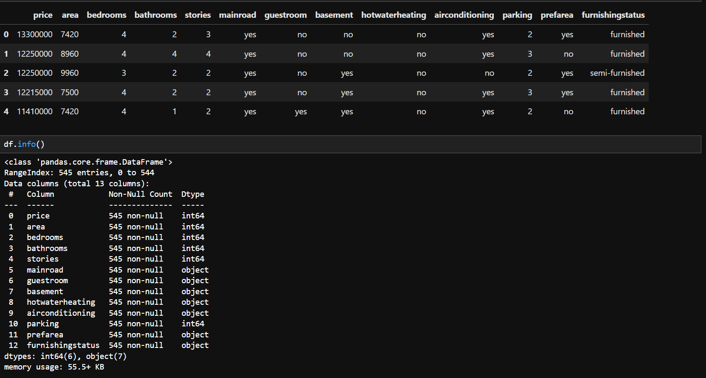
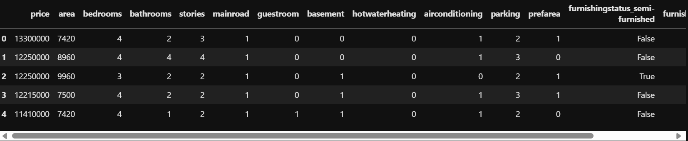
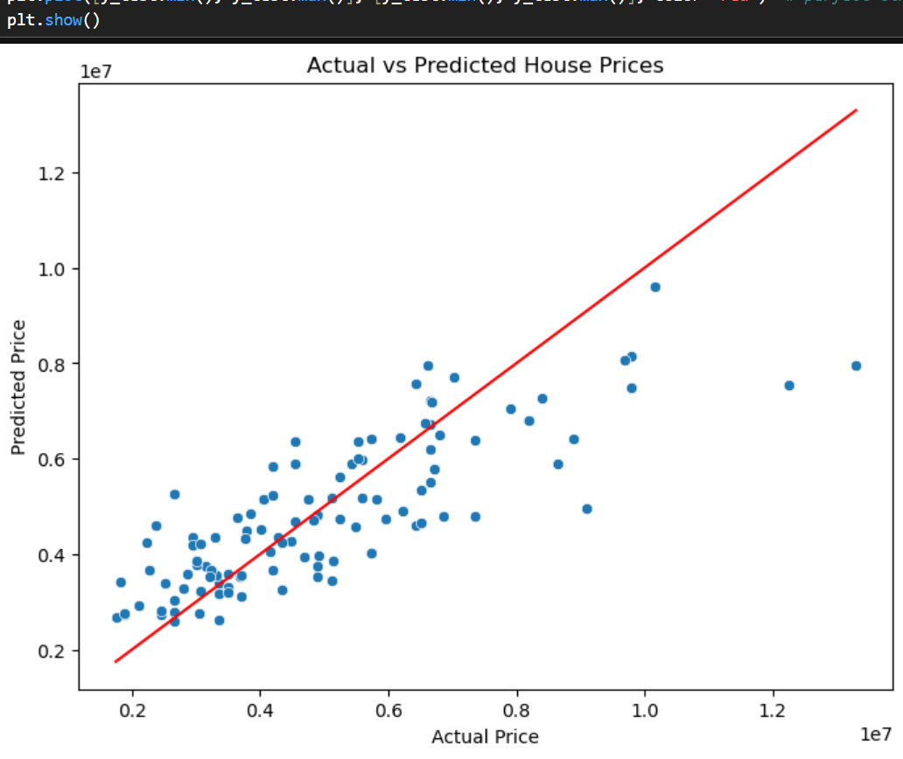
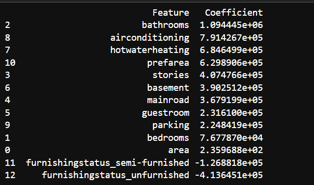

# House Price Prediction – Linear Regression (Task 3)

## Task Objective  
 Implement and understand simple & multiple linear regression.

## 🔧 Tools Used  
- Python  
- Pandas  
- Scikit-learn  
- Matplotlib  
- Seaborn

## What I Did

1. **Imported and explored the dataset**  
   Used `.info()` and `.isnull().sum()` to check for missing values — found none. Manually reviewed columns for categorical data.

2. **Preprocessed categorical features**  
   - Used `.map()` to convert binary values (`yes/no`) to 0 and 1 for features like `mainroad`, `basement`, etc.  
   - Used `pd.get_dummies()` to one-hot encode `furnishingstatus`.

3. **Split data into features and target**  
   - Used `.drop()` to separate `price` from other features  
   - `X` = features, `y` = target

4. **Split into training and test sets**  
   - Used `train_test_split()` with `test_size=0.2` and `random_state=42`

5. **Trained a Linear Regression model**  
   - Used `LinearRegression()` and `.fit()` on the training data

6. **Predicted and evaluated**  
   - Used `.predict()` to get predictions  
   - Calculated `MAE`, `MSE`, and `R²` using `mean_absolute_error`, `mean_squared_error`, and `r2_score`

7. **Visualized predictions**  
   - Plotted actual vs predicted using `sns.scatterplot()`  
   - Added red reference line to indicate perfect prediction

8. **Interpreted model coefficients**  
   - Used `model.coef_` and `.sort_values()` to identify the most influential features

##  Evaluation Metrics

- **MAE:** ₹9,70,043  
- **MSE:** ₹1.75 Trillion  
- **R² Score:** 0.65

## 🧠 Key Inferences

- **Bathrooms (+₹10.9L)** was the most influential feature for predicting price  
- Other strong positive contributors:  
  - Air Conditioning (+₹7.9L)  
  - Hot Water Heating (+₹6.8L)  
  - Preferred Area (+₹6.3L)

- **Unfurnished homes** dropped the price significantly (−₹4.13L)  
- Surprisingly, **Area** had the smallest positive coefficient (~₹236), possibly due to scaling or multi-collinearity

## 📷 Screenshots

-  – Output of `.info()` and `.isnull().sum()`  
-  – Output of the Dataframe after cleaning and Encoding 
-  – Scatterplot comparing predicted vs actual prices  
-  – Sorted list of feature importances based on model coefficients

---

## 📁 Files in this Repo

- `house_price_lr.ipynb` – Jupyter notebook with full code  
- `README.md` – This file  
- Screenshots – PNG files used above  
- `Housing.csv` – Original dataset
